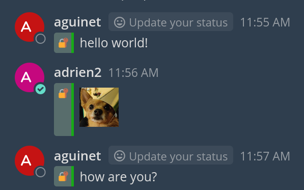
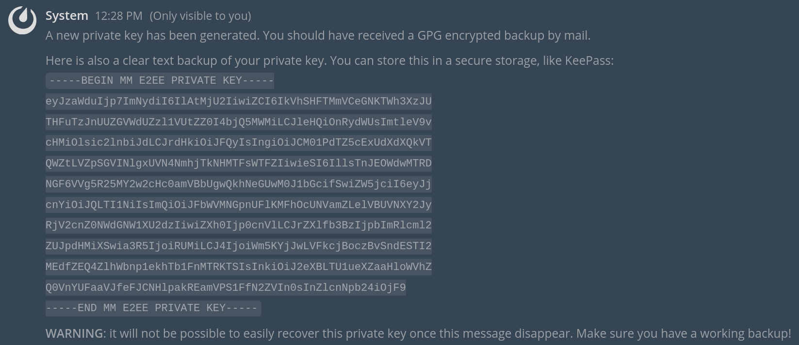
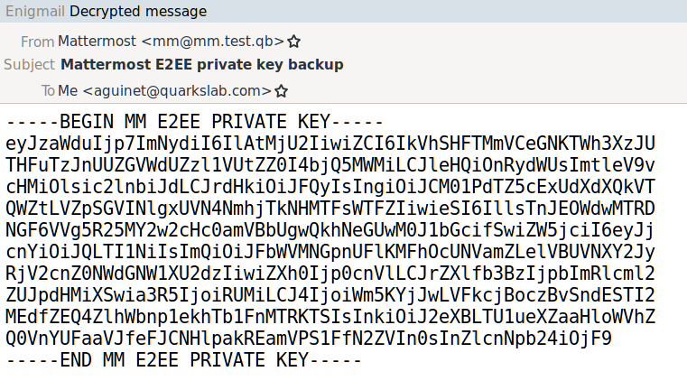
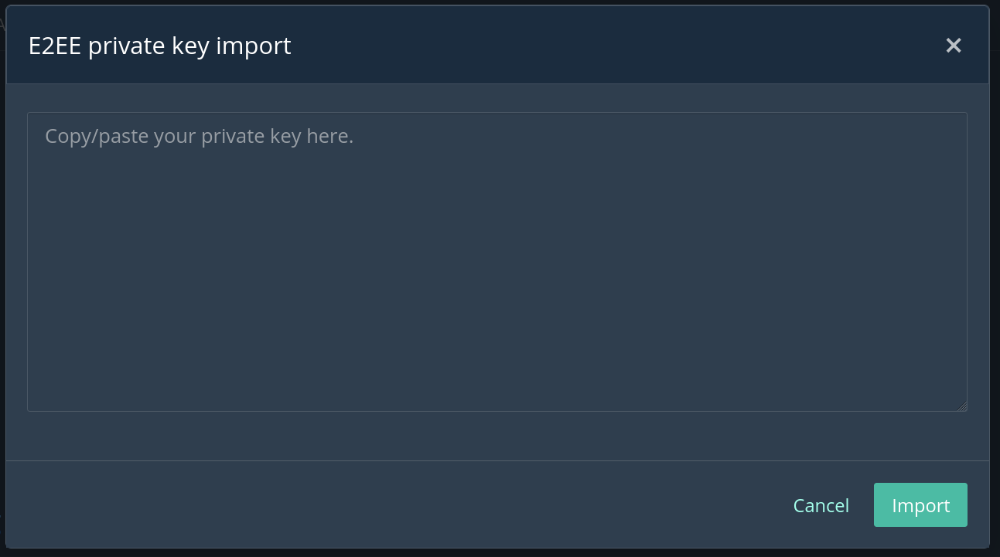
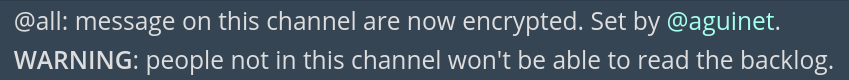
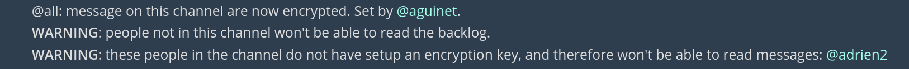
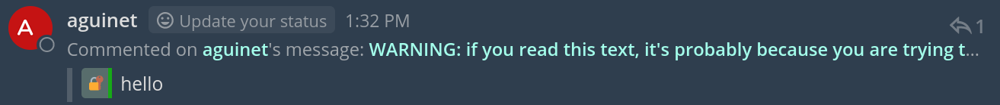

<div align="center" width="100%">
  
</div>

# Mattermost E2EE plugin (by [Quarkslab](https://quarkslab.com))

This plugin brings end-to-end encryption (E2EE) to Mattermost. It uses the
[WebCrypto
API](https://developer.mozilla.org/en-US/docs/Web/API/Web_Crypto_API), and [non
extractable private
keys](https://www.w3.org/TR/WebCryptoAPI/#dfn-CryptoKey-extractable). See [the
design document](docs/design.md) for more details on the attack models
considered and the cryptographic schemes used.

Please **carefully read** the [known limitations](#known-limitations) before
using of this plugin. 

This document describes how to [install](#installation) the plugin, it contains
the [end user documentation](#quick-start) and [instructions to setup a
developer environment](#development).

<div align="center" width="100%">
  
</div>

## Installation

You can download the [latest release
archive](https://github.com/quarkslab/mattermost-plugin-e2ee/releases) and
upload it in Mattermost's system console: open `Main Menu > System Console >
Plugins (BETA) > Plugin Management > Upload Plugin` to upload the archive.
Upgrades can be performed by importing the latest release and confirming the
overwriting of the duplicate plugin ID.

### Plugin configuration

The plugin has a few configuration entries:

### URL of the GPG key server

It contains the URL of a GPG key server used to gather a GPG public key that
belongs to the user. It uses the [HKP
protocol](https://datatracker.ietf.org/doc/html/draft-shaw-openpgp-hkp-00) to
search for a valid key for the user's email address. This public GPG key is
then used to encrypt the user's [E2EE private key on
key initialisation](#private-key-generation--backup). Leave empty if you don't
want GPG encrypted backup of users' private keys.

### Allow Bots to always post

We prevent unencrypted messages to be posted on encrypted channels. This allows
bot users to override this rule.

### Custom messages types to always allow

We prevent unencrypted messages to be posted on encrypted channels. This
setting allows some custom message types to override this rule. The list should
be comma separated. For instance, if you want the [Jitsi
plugin](https://github.com/mattermost/mattermost-plugin-jitsi) to work even on
encrypted channels, you can set `custom_jitsi` here.

## Quick start

`/e2ee init` generates your private key and displays a backup you can save in a
secure location. If it manages to do so, it will also send a GPG encrypted
backup of that private key. In that case, you will be asked to verify the GPG
key server used and the public key ID retrieved are legit.

`/e2ee start` sets the current channel in encryption mode. This means that
every message sent on that channel must be encrypted. `/e2ee stop` puts the
channel back in clear text mode.

`/e2ee help` shows a help message with the available commands.

## Persistent storage on Firefox

We use [persistent storage on
Firefox](https://developer.mozilla.org/en-US/docs/Web/API/IndexedDB_API/Browser_storage_limits_and_eviction_criteria#different_types_of_data_storage),
so that your private key doesn't get deleted by Firefox, forcing you to
reimport it on a recurrent basis. Firefox will ask you to accept for the
Mattermost instance to do so. Click on `Accept` if that's something you wish.

## Detailed usage instructions

### Private key generation & backup

The `/e2ee init` command generates your private key:

<div align="center" width="100%">
  
</div>

As we can see in the screenshot above, the plugin dumps a **clear text**
version of your private key, that you can backup in a secure password storage,
like [KeePass](https://keepass.info/). Make sure that you have the full text
between `----BEGIN MM E2EE PRIVATE KEY----` and `----END MM E2EE PRIVATE
KEY-----`, with these headers included.

Moreover, if a GPG server key has been configured, and a public key associated
with your Mattermost account's email exists, you will be asked to verify that
the GPG key server used to get that key and the public key ID retrieved itself
are legit. If you confirm, you will receive a GPG encrypted backup of your
private key.

<div align="center" width="100%">
  
</div>

This backup can then be used to reimport your private key in another browser.

### Private key import

The `/e2ee import` command shows a dialog box where you can paste your private
key backup:

<div align="center" width="100%">
  
</div>

If you try to import a key that has a public counterpart different from the one
known by the server, a message will ask you to confirm this action. Indeed,
changing your public key will have the consequence that no one will be able to
authenticate your **old** messages anymore. The plugin will refuse to show
them, and show an `integrity check failed` error.
 
### Channel encryption

The choice whether messages are encrypted or not is done on a per-channel
basis. The `/e2ee start` command activates encryption on the current channel:

<div align="center" width="100%">
  
</div>

When encryption is activated for a channel, but some people still haven't
[setup a private key](#private-key-generation-backup), a message shows you who
will not be able to read the messages on the channel:

<div align="center" width="100%">
  
</div>

`/e2ee stop` deactivates encryption for the current channel. If encryption
hasn't been deactivated by *you* on a channel, you will be prompted by a
message asking you to confirm you want to send unencrypted messages on this
channel the next time you send a post.

Private messages work like the other channels, and the same commands can be used.

## Known limitations

### Files/attachments not encrypted

For now, files & attachments are **not encrypted**. This will be done in future
releases (if possible).

Progress on this issue is tracked in [#7](https://github.com/quarkslab/mattermost-plugin-e2ee/issues/7).

### Webapp integrity

In the attack model where the server is considered as compromised, nothing
prevents the server from serving malicious Javascript code that could send clear
text messages alongside their encrypted counterpart. Moreover, code could also be injected to
decrypt old messages. This problem is described in detail
[here](https://www.pageintegrity.net/browsercrypto.php#thebrowsercryptochickenandeggproblem).

Note that, as the private key is kept as *non extractable* in the browser, even
malicious Javascript code can't just extract and dump your private key. It
would need to exploit a vulnerability in the browser itself (but you might have
bigger issues at this moment).

The Firefox [Page Integrity](https://www.pageintegrity.net/) plugin could help
solve this problem, by checking that the shipped Mattermost web application is
known against a list of known hashes. Unfortunately (in this case), Mattermost
plugins' Javascript code is "dynamically" loaded by the main Mattermost
application, so bypassing this check in some ways.

Fixing this is work-in-progress, and any help or suggestions would be
appreciated! Please refer to ticket
[#6](https://github.com/quarkslab/mattermost-plugin-e2ee/issues/6).

### Initial support for notifications from mentions

Mentions (like `@all`) in encrypted messages would display a notification, but
with these limitations:

* the notification sound might not be played, depending on the OS & platform
* "activating" the notification would display the Mattermost application/tab,
  but won't switch to the team/channel were the notification occured

Fixing these issues could be done by being able to use the [notifyMe function
from mattermost-webapp](), which could be [exposed to plugins]().

Progress on this issue is tracked in [#1](https://github.com/quarkslab/mattermost-plugin-e2ee/issues/1).

### Unable to update messages (Mattermost < 6.1)

**Note**: this limitation only exists if you use Mattermost < 6.1

Due to a [limitation in
Mattermost < 6.1](https://github.com/mattermost/mattermost-server/issues/18320), it
is not possible in these versions for a webapp plugin to intercept message modifications.
Thus, we are not able to encrypt the modified message before it is transmitted
to the server.

If you try to modify a message, you will be prompted with a warning message
instead of the original one. We've done this to prevent accidental leakage of
decrypted messages to the server. Indeed, when you click on the `Save` button,
the content of the modified message is sent in plain text to the server.

### Broken thread/reply UI (Mattermost < 6.1)

**Note**: this limitation only exists if you use Mattermost < 6.1

Due to the previous limitation, when you reply to an encrypted message, the
warning message discussed above will be shown instead of the decrypted one:

<div align="center" width="100%">
  
</div>

## Development

This section describes how to setup a development environment.

### Environment

We make a build environment based on Mattermost's [local node docker](https://docs.mattermost.com/install/setting-up-local-machine-using-docker.html).

We adapt the `mattermost/mattermost-preview` image to add various things:

* enable the creation of tokens
* enable the creation of accounts without invitations

The provided `docker/Dockerfile` will create a new docker image with these modifications.

First, build the image:

```
$ cd docker && docker build -t matterdev .
```

Then, run the Mattermost instance. We need to mount `/var/tmp` as an external
volume to get a Mattermost unix socket that will help to easily deploy our plugin:

```
$ cd /path/to/project
$ docker run --name mminstance -d --publish 8065:8065 --add-host dockerhost:127.0.0.1 matterdev
```

It takes a few minutes to boot. You can then access the instance at `http://127.0.0.1:8065`. Create a user and a team.

The next step is to create a user token. Go to `Account Settings`, `Security` and
add a new personal token. This is needed to deploy the plugin (see below).

To rerun the docker container (if stopped), just do `docker start mminstance`. To
run a shell within this container, you can do `docker exec -it mminstance
/bin/bash`.

### Deploying

Based on [these instructions](https://github.com/mattermost/mattermost-plugin-starter-template#deploying-with-local-mode).

First, copy `dev.env.example` into `dev.example`, and setup the user token you
just created above. Then:

```
$ source dev.env
$ make watch
```

This will do two things:

* build the server plugin and upload it on the mattermost instance
* build the webapp, watch for changes and rebuild it when a file changes

Note that changing the server-side code requires at least doing `make deploy`
to build & deploy the changes.

### Build the plugin (release)

Build your plugin:
```
make
```

This will produce a single plugin file (with support for multiple
architectures) to upload to your Mattermost server:

```
dist/com.quarkslab.mm-e2ee.tar.gz
```

## Q&A

### How do I build the plugin with unminified JavaScript?
Setting the `MM_DEBUG` environment variable will invoke the debug builds. The easiest way to do this is to simply include this variable in your calls to `make` (e.g. `make dist MM_DEBUG=1`).

## Contributors

* Adrien Guinet
* Pierre Veber
* Angèle Bossuat
* Charlie Boulo
* Guillaume Valadon

## Acknowledgment

Special thanks to the people who battle tested this on some underground
Mattermost instances!
